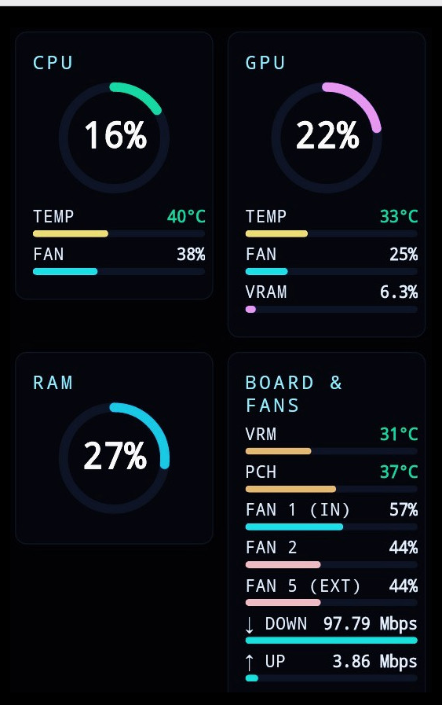
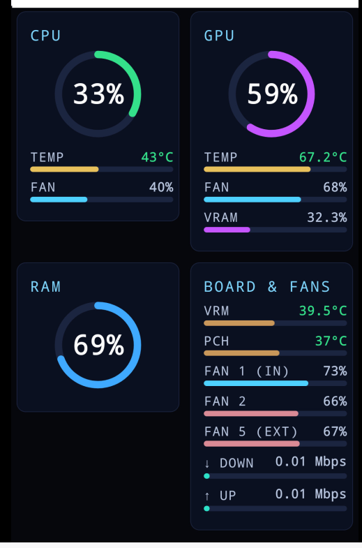

# ExtDash — другий екран для моніторингу ПК зі старого телефону

Перетворює будь-який телефон із браузером на живий дашборд для Linux-ПК:
CPU, GPU, RAM, температури материнської плати, корпусні вентилятори, мережа.
Дані оновлюються в реальному часі, окремий застосунок на телефон не потрібен.

Ця версія — **Linux**. Версія для Windows розробляється окремо.

## Скріншоти

| HTC One S (Android 4.1.1, 2012) | OnePlus 9 (LineageOS) |
|---|---|
|  |  |

Той самий `index.html` відкривається і на телефоні 2012 року, і на сучасному.

## Як це працює

```
Телефон (браузер) ──HTTP──► Flask-сервер (порт 8080)
                              ├── Glances API (порт 61208): CPU, GPU, RAM, мережа
                              └── lm-sensors (sensors -j): вентилятори, VRM, PCH
```

Сервер `pc_dashboard_server.py` об'єднує дані Glances і `sensors -j` в один
JSON (`/data`) і віддає сторінку `index.html`. Які саме сенсори показувати,
визначає `sensor_config.json`, який створює `setup_wizard.py`.

## Що показує дашборд

| Блок | Дані |
|---|---|
| CPU | Навантаження %, температура, вентилятор % |
| GPU | Навантаження %, температура, вентилятор %, VRAM % |
| RAM | Використання % |
| Board & Fans | VRM і PCH температури, довільна кількість корпусних вентиляторів, мережа (↓/↑) |

Відсоток вентилятора рахується з реальних обертів:
`(RPM − мін) / (макс − мін)`. Тому мінімум і максимум для кожного
вентилятора потрібно задати вручну (див. нижче).

## Вимоги

- Linux, Python 3.10+ (перевірено на Python 3.12, Linux Mint)
- `lm-sensors` з налаштованими датчиками
- Glances 4.x з веб-режимом, Flask
- `nvidia-ml-py` — лише для відеокарт NVIDIA (GPU-дані Glances бере через нього)
- ПК і телефон в одній локальній мережі

Перевірені версії: Glances 4.5.6–4.5.7, Flask 3.1.3, nvidia-ml-py 13.610–13.615.

## Встановлення

1. Системні пакети і датчики:

   ```bash
   sudo apt install lm-sensors
   sudo sensors-detect      # відповідайте "yes" на типові питання
   ```

2. Python-залежності:

   ```bash
   pip install --user "glances[web]" flask nvidia-ml-py
   ```

   На дистрибутивах із PEP 668 (Ubuntu 24.04, Mint 22) `pip` може відмовитися
   ставити пакети у користувацький каталог. Тоді використайте віртуальне
   середовище (встановлення перевірено саме так):

   ```bash
   python3 -m venv ~/extdash-venv
   ~/extdash-venv/bin/pip install "glances[web]" flask nvidia-ml-py
   ```

   У цьому разі запускайте `~/extdash-venv/bin/glances -w` та
   `~/extdash-venv/bin/python pc_dashboard_server.py`, а в systemd-сервісах
   замініть шляхи в `ExecStart` на відповідні.

3. Завантажте проєкт у `~/ExtDash` і запустіть майстер налаштування:

   ```bash
   git clone https://github.com/Norman-byte/ExtDash-linux.git ~/ExtDash
   cd ~/ExtDash
   python3 setup_wizard.py
   ```

   Майстер показує всі знайдені вентилятори й температури; ви вибираєте CPU-кулер, корпусні вентилятори, датчики CPU/VRM/PCH і мережевий
   інтерфейс. Результат записується в `sensor_config.json` поруч зі скриптом.

   Вентилятори обирайте за назвою секції (`System Fan #N`), а не за порядковим номером у списку: після кожного вибору список перенумеровується.

4. Запуск вручну (для перевірки):

   ```bash
   glances -w &
   python3 pc_dashboard_server.py
   ```

   Відкрийте на телефоні `http://<IP-вашого-ПК>:8080`.
   Дані у форматі JSON: `http://<IP-вашого-ПК>:8080/data`.

## Вимірювання RPM для вентиляторів

Майстер запитує мінімальні та максимальні оберти кожного вентилятора.
Значень за замовчуванням немає: діапазон залежить від моделі й розміру,
а хибний діапазон дає хибні відсотки.

- **Максимум** — оберти на повній швидкості (вентилятор на 100% в BIOS/UEFI
  або в іншій програмі моніторингу).
- **Мінімум** — оберти на холостому ході. Для вентиляторів, що
  зупиняються, це 0.
- Поточні оберти видно у списку майстра та у виводі `sensors`.

Максимум має бути більшим за мінімум.

## Автозапуск (systemd, режим користувача)

У теці `systemd/` лежать шаблони сервісів. Вони припускають, що проєкт
знаходиться в `~/ExtDash`, а Glances — у `~/.local/bin/glances`.
Якщо це не так, виправте шляхи в `ExecStart`.

```bash
mkdir -p ~/.config/systemd/user
cp systemd/*.service ~/.config/systemd/user/
systemctl --user daemon-reload
systemctl --user enable --now glances-extdash.service pc-dashboard-extdash.service
loginctl enable-linger "$USER"     # щоб сервіси стартували без входу в систему
```

Перевірка: `systemctl --user status pc-dashboard-extdash.service`.

## Безпека

Сервер слухає на `0.0.0.0:8080` **без автентифікації** і віддає дані про
апаратну частину ПК. Використовуйте лише в довіреній локальній мережі й не
відкривайте порт назовні.

## Температура GPU на Linux

Linux-версія показує температуру **ядра (Core)**. NVIDIA не надає
hotspot/junction-температуру через Linux-драйвери ні в `nvidia-smi`, ні в
NVML. Реальна температура кристала в найгарячішій точці зазвичай на
10–20 °C вища, тому залишайте запас до теплового ліміту виробника.

## Ліцензія

MIT — використовуйте, змінюйте, поширюйте вільно.

## Про розробку

Проєкт створено в парі з Claude (Anthropic): від реанімації старого
HTC One S до Linux-бекенду. Усе розбиралося й тестувалося крок за кроком,
включно з реальними глухими кутами (обмеження NVIDIA-драйверів на Linux,
розбіжності між PWM і реальними обертами) та їхніми практичними рішеннями.
